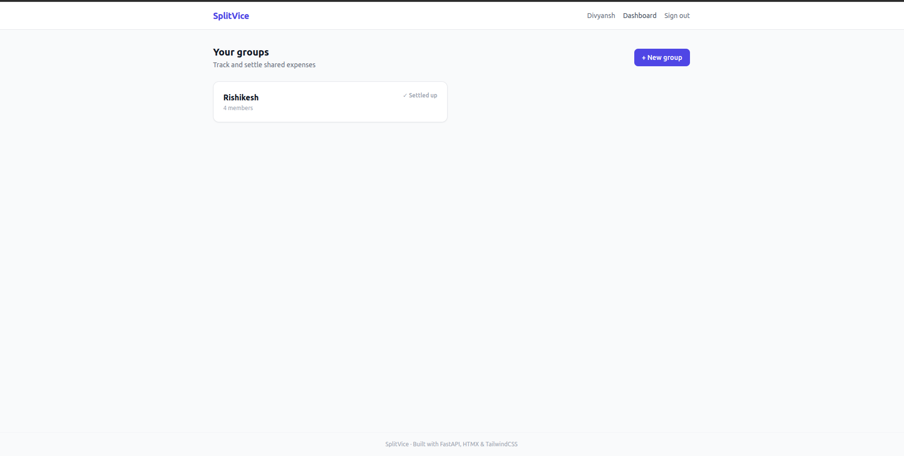
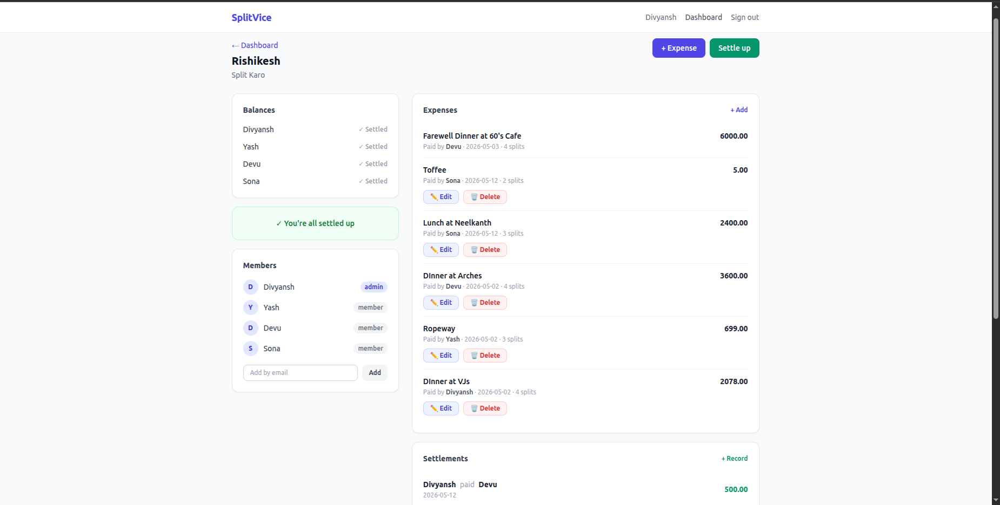
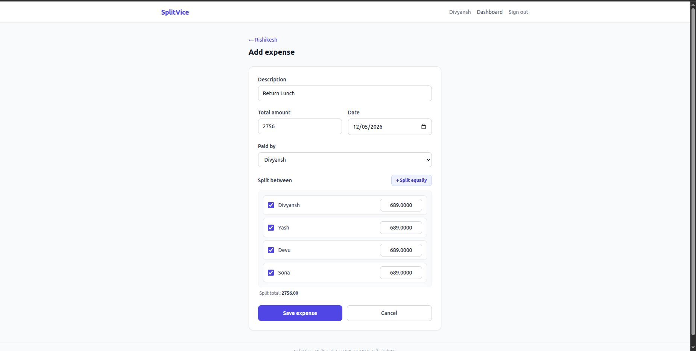
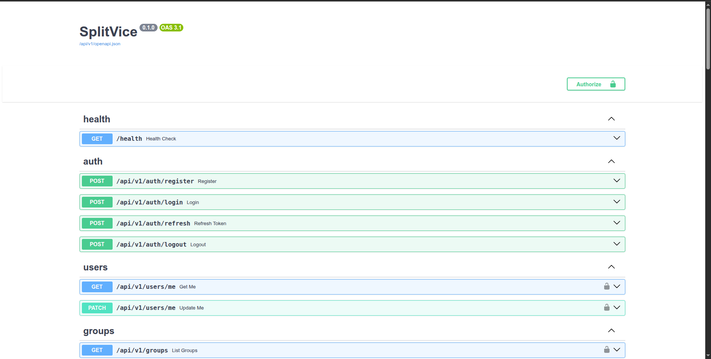

# SplitVice

A production-style expense sharing platform inspired by Splitwise, built with FastAPI, HTMX, PostgreSQL, and async SQLAlchemy.

SplitVice focuses on:
- financial correctness
- backend architecture
- maintainability
- server-rendered simplicity
- production-ready engineering

---

# 🚀 Live Demo

- Live App: `Coming Soon`
- Swagger Docs: `http://localhost:8000/api/v1/docs`
- Health Check: `http://localhost:8000/health`

---

# 📸 Application Preview

## Dashboard Overview

> Add Screenshot Here  
> Suggested screenshot:
> - User dashboard
> - Group summaries
> - Recent expenses
> - Current balances

```md

```

---

## Group Balances & Settlement Suggestions

> Add Screenshot Here  
> Suggested screenshot:
> - "Who owes whom"
> - Simplified settlements
> - Group member balances

```md

```

---

## Expense Creation Flow

> Add Screenshot Here  
> Suggested screenshot:
> - Expense form
> - Participant selection
> - Equal split preview
> - HTMX interaction

```md

```

---

## Swagger API Documentation

> Add Screenshot Here  
> Suggested screenshot:
> - FastAPI Swagger UI
> - Expense endpoints
> - Auth endpoints

```md

```

---

# ❓ Why SplitVice?

Most Splitwise-style clones focus primarily on frontend polish.

SplitVice was built to explore:
- financially correct balance computation
- scalable backend architecture
- async Python systems
- maintainable monolith design
- production deployment patterns

The goal was to build something closer to a real backend system rather than a tutorial CRUD application.

---

# ✨ Core Features

## Authentication
- JWT access + refresh tokens
- Secure HttpOnly cookie auth
- Bearer token auth support
- Password hashing with bcrypt
- Refresh token invalidation on logout

## Groups
- Create and manage groups
- Admin/member role support
- Add/remove members
- Leave group protections
- Group balance summaries

## Expenses
- Exact split expense tracking
- Equal split generation
- Live split validation
- Edit/delete expenses
- Soft delete support
- Atomic expense + split transactions

## Balances
- Dynamic balance computation
- Participant-aware expense handling
- Simplified debt calculation
- Settlement suggestions
- Exact Decimal-based accounting
- Balances always sum to zero

## Settlements
- Record repayments
- Pairwise debt validation
- Settlement reversal support
- Automatic balance recomputation

## Web UI
- Server-rendered frontend
- HTMX-enhanced interactions
- TailwindCSS styling
- Responsive layout
- Dashboard + group pages

## Production Features
- Dockerized deployment
- PostgreSQL + Alembic migrations
- Structured logging
- Security headers middleware
- Optional Sentry integration
- Health checks
- 169 integration tests

---

# 🏗️ High-Level Architecture

> Add Architecture Diagram Here

Suggested diagram:

```text
Browser
   ↓
HTMX + TailwindCSS
   ↓
FastAPI Routes
   ↓
Service Layer
   ↓
Repository Layer
   ↓
PostgreSQL
```

```md

```

---

# ⚙️ Tech Stack

## Backend
- Python
- FastAPI
- SQLAlchemy 2.0 Async
- Alembic
- PostgreSQL
- Redis (minimal MVP usage)

## Frontend
- HTMX
- Jinja2 Templates
- TailwindCSS

## Infrastructure
- Docker
- Docker Compose
- Railway deployment ready
- Render deployment ready

## Testing
- pytest
- Async integration testing
- SQLite in-memory isolated test database

---

# 🧠 Key Engineering Decisions

## Dynamic Balance Computation

SplitVice intentionally does not store balances directly in the database.

Balances are computed dynamically from:
- expenses
- expense splits
- settlements

Benefits:
- avoids stale cached balances
- guarantees consistency
- simplifies correctness validation
- easier rollback/recomputation

---

## Decimal-Based Accounting

All financial calculations use Python `Decimal`.

No floats are used anywhere in money computation.

Benefits:
- precise accounting
- avoids floating point inaccuracies
- deterministic balance calculations

---

## HTMX Instead of React

SplitVice intentionally uses:
- server rendering
- HTMX interactions
- minimal frontend complexity

Benefits:
- faster iteration
- simpler deployment
- lower frontend overhead
- easier maintainability

---

## Modular Monolith Architecture

The project intentionally avoids:
- microservices
- event buses
- CQRS
- websocket complexity
- premature distributed systems design

Benefits:
- simpler debugging
- faster development
- easier local setup
- maintainable solo-developer workflow

---

# 📁 Project Structure

```text
.
├── app/
│   ├── api/             # HTTP routes
│   ├── core/            # config, security, utilities
│   ├── db/              # database setup
│   ├── models/          # ORM models
│   ├── repositories/    # database access layer
│   ├── schemas/         # Pydantic schemas
│   ├── services/        # business logic
│   ├── web/             # server-rendered routes
│   ├── templates/       # Jinja2 templates
│   ├── static/          # CSS/JS/assets
│   └── main.py
│
├── migrations/
├── tests/
├── Dockerfile
├── docker-compose.yml
├── pyproject.toml
└── README.md
```

---

# 💰 Core Financial Model

SplitVice computes balances dynamically from:
- expenses
- expense splits
- settlements

No balances are stored directly.

For every expense:

```text
net balance =
amount paid
-
amount owed
```

Only users present in `expense_splits` participate in an expense.

This ensures:
- participant-aware accounting
- correct partial participation handling
- accurate debt simplification

All money calculations use Python `Decimal`.

Balances always sum to zero.

---

# 📊 Example Balance Flow

Group:
- Alice
- Bob
- Charlie
- David

Expense 1:
- Alice pays ₹400
- Split equally among all 4

Result:
- Alice +300
- Bob -100
- Charlie -100
- David -100

Expense 2:
- Bob pays ₹300
- Split among Bob, Charlie, David

Result:
- Alice unaffected
- Bob +200
- Charlie -100
- David -100

Final:
- Alice +300
- Bob +100
- Charlie -200
- David -200

Balances always sum to zero.

---

# 🔌 Example API Usage

## Create Expense

```bash
POST /api/v1/expenses
```

Request:

```json
{
  "group_id": 1,
  "paid_by": 2,
  "amount": "1200.00",
  "description": "Dinner",
  "participants": [1, 2, 3]
}
```

Response:

```json
{
  "id": 14,
  "status": "success",
  "message": "Expense created successfully"
}
```

---

# 🚀 Quick Start

## 1. Clone Repository

```bash
git clone <your-repo-url>
cd splitvice
```

---

## 2. Create Environment File

```bash
cp .env.example .env
```

Generate JWT secret:

```bash
python -c "import secrets; print(secrets.token_hex(32))"
```

---

## 3. Install Dependencies

```bash
pip install -e ".[dev]"
```

---

## 4. Start PostgreSQL

```bash
docker compose up db -d
```

---

## 5. Run Database Migrations

```bash
alembic upgrade head
```

---

## 6. Start Application

```bash
uvicorn app.main:app --reload
```

Application:
```text
http://localhost:8000
```

Swagger Docs:
```text
http://localhost:8000/api/v1/docs
```

Health Check:
```text
http://localhost:8000/health
```

---

# 🐳 Docker Deployment

Run entire stack:

```bash
docker compose up
```

---

# 🧪 Testing

SplitVice uses integration-heavy testing focused on:
- transactional correctness
- balance computation
- settlement consistency
- auth flows
- API behavior

Run tests:

```bash
python -m pytest tests/ -v
```

Testing setup includes:
- isolated SQLite in-memory DB
- async test environment
- independent schema per test

Current coverage:
- 169 integration tests
- zero warnings

---

# 📚 API Documentation

Interactive Swagger UI:

```text
/api/v1/docs
```

OpenAPI schema:

```text
/api/v1/openapi.json
```

---

# 🌍 Environment Variables

| Variable | Description |
|---|---|
| JWT_SECRET | JWT signing secret |
| DATABASE_URL | PostgreSQL connection string |
| ENV | development / production |
| DEBUG | Enable debug logging |
| ACCESS_TOKEN_EXPIRE_MINUTES | Access token lifetime |
| REFRESH_TOKEN_EXPIRE_DAYS | Refresh token lifetime |
| SENTRY_DSN | Optional Sentry integration |
| ALLOWED_HOSTS | Trusted production hosts |

---

# 🛡️ Production Features

- Secure cookies in production
- Structured JSON logging
- Security headers middleware
- Health checks
- Dockerized deployment
- Sentry integration support
- Trusted host validation

---

# 🚢 Deployment

SplitVice is designed for simple monolith deployment.

Recommended platforms:
- Railway
- Render

Deployment model:
- one FastAPI service
- one PostgreSQL database

No separate frontend deployment required.

---

# ⚖️ Tradeoffs & Scaling Decisions

## Why No Microservices?

The project prioritizes:
- development speed
- maintainability
- simplicity
- correctness

Microservices would introduce:
- deployment complexity
- distributed debugging
- infrastructure overhead

without meaningful benefits at this scale.

---

## Why No Redis Balance Cache?

Balances are intentionally computed dynamically for correctness.

Caching can be introduced later if profiling proves it necessary.

---

## Why No WebSockets?

The application currently prioritizes:
- simplicity
- maintainability
- backend architecture exploration

Real-time sync can be added later if needed.

---

# 🔮 Future Improvements (v2)

Planned but intentionally deferred:

- Redis balance caching
- Notifications/activity feed
- Expense search/filtering
- Avatar uploads
- CSV export
- Audit logs
- Rate limiting
- Additional security hardening
- CI/CD pipeline
- Coverage reporting
- Role-based permission expansion

---

# 🎯 Design Principles

SplitVice prioritizes:
- correctness
- maintainability
- explicit logic
- backend-first architecture
- shipping speed
- pragmatic engineering

Over:
- premature optimization
- unnecessary abstractions
- enterprise ceremony
- distributed complexity

---

# 👨‍💻 Author

Built by Divyansh.

Inspired by Splitwise, rebuilt with a pragmatic Python-first architecture focused on correctness, maintainability, and production-style backend engineering.
